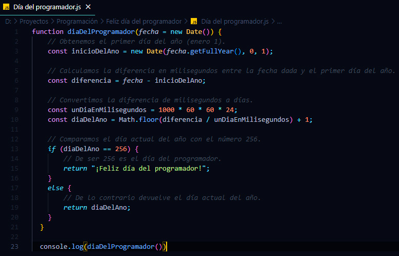

# Devuelve datos sobre la fecha actual

Devuelve datos sobre la fecha actual en base a datos en un .json.
Por ejemplo:
Devuelve ¡Feliz día del profesor! el 17 de septiembre o el día del año 256 ¡Feliz día del programador!

